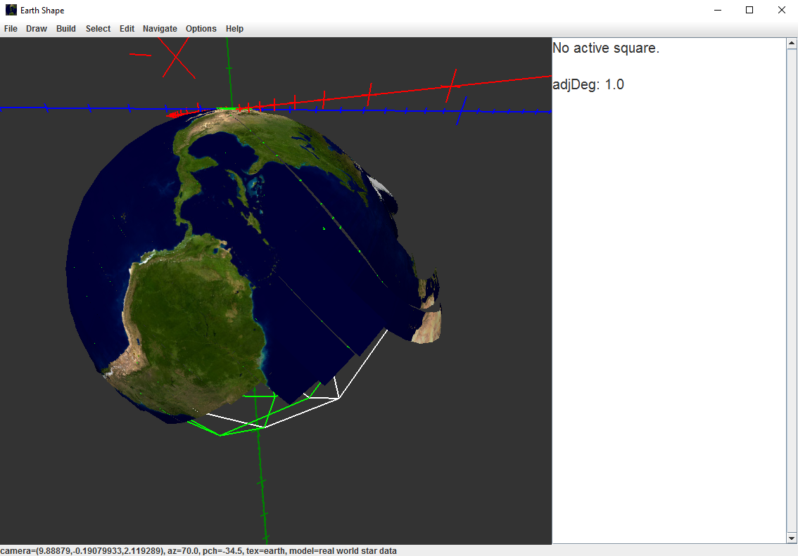
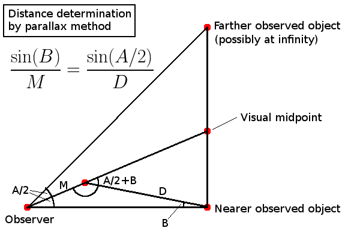

# EarthShape

EarthShape is a program that takes as input a set of star
observation data for various locations on the Earth, along
with distances and headings for shortest paths between those
locations, and figures out a size and shape for the Earth's
surface that is consistent with that data, if any.

Purpose
=======

It is reasonable to ask how we know that the Earth has the size
and shape that it does.  Directly looking at the Earth
from its surface is problematic because, near the
surface, refraction bends light and air scatters it.
There are of course a multitude of other ways to measure
the shape of the Earth, but many require either expensive
equipment or reliance on other assumptions that then need
to be justified.

However, there is a simple, intuitive
technique that relies a minimum of assumptions and can be
completely and independently carried out by amateurs: collect
observations of star positions from various locations, then
try to find a surface consistent with that data.

This program crunches the observational data to find that
surface, if one exists.

Compiling and running
=====================

This section explains how to compile and run EarthShape.

Dependencies
------------

Currently, EarthShape is only known to run on 64-bit Windows.

EarthShape requires a Java compiler.  It probably requires
Java 8 (I have not tested older versions).  A Java compiler
is included in the Java Development Kit available from Oracle.
Google for "jdk download".  When you install it, add its
"javac" and "java" programs to your command line PATH.

The EarthShape build process is written using GNU Make.  GNU
Make is part of [Cygwin](https://www.cygwin.com/).  When you
run its setup program, be sure to choose to install "make"
(in the "Devel" category) along with the other tools it
installs by default.  (If you are an experienced Java developer,
you can use Eclipse to build as well.  There's nothing
unusual about the build.)

EarthShape uses the [JOGL library](https://jogamp.org/jogl/www/).
To get it, you need to download this file:

[https://jogamp.org/deployment/jogamp-current/archive/jogamp-all-platforms.7z](https://jogamp.org/deployment/jogamp-current/archive/jogamp-all-platforms.7z)

To unpack that file, you need [7Zip](http://www.7-zip.org/download.html).

Compiling
---------

Unpack jogamp-all-platforms.7z somewhere.  Then edit the Makefile
inside the "earthshape" directory and change the "JOGL" variable
to be the full path to the "jars" subdirectory of the JOGL
installation.

In the earthshape directory, from a Cygwin shell, run "make".

Running
-------

In the earthshape directory, from a Cygwin shell, run "make run".

Usage
=====

When EarthShape starts, you see a blank 3D area in which a surface
will be reconstructed by adding squares that align with star
observation data.  Press "T" to run that reconstruction process.
It takes a few seconds to run.

To look around in the 3D area, click on it to enter "first person
shooter" mode.  Then, press the W/A/S/D keys to move horizontally,
Space and Z to move vertically, and move the mouse to look around.
Press Esc to leave this mode.

Press "C" to texture the squares with a map image to make their
locations more recognizable.

Look in the menus for other commands and features.  The Help menu
has an option to show all the key bindings.

Theory of operation
===================

EarthShape reconstructs the surface of
the Earth using star observation from a specific point in time,
namely 2017-03-05 20:00 -08:00.  That happens to be when I began
writing this program, so is when I collected the data it uses.

The observations use data for eight particular stars: Capella,
Betelgeuse, Rigel, Aldebaran, Sirius, Procyon, Polaris, and Dubhe.
These stars were selected due to being bright stars easily visible
with the naked eye in the early evening sky at my latitude (38N)
during March.

In its initial configuration, EarthShape uses the full set of real-world
star data, and does *not* assume the stars are infinitely far away.
Furthermore, it restricts itself to star observations that are
above 20 degrees above the horizon (to avoid problems with
refraction; see Assumptions below), and to locations where the Sun
is at least 5 degrees below the horizon (since otherwise stars
would not be visible to the naked eye).

Consequently, the reconstruction stops at about 140W longitude
due to it being daytime there, and rapidly loses fidelity at about
59W due to there being too few of the original eight stars above
20 degrees above the horizon to uniquely constrain the solution.

The first square placed is, by default, at a surface coordinate
of 38N 122W; this is in the San Francisco Bay Area, where I live.
The square is placed in 3D space at the origin with its North
oriented towards the +Z axis.

Each later square is built by creating a new square adjacent to
an existing square, and then aligning the star observation data
for *just those two* squares.
Once its surface coordinate (latitude and longitude) is specified,
which determines its distance from the base square, placement of
the new square has three degrees of freedom: roll, pitch, and
yaw of its orientation in space.  These can be adjusted manually or automatically (see menu
for keybindings).  Adjusting the orientation also changes the
location in space since it affects the direction of travel.

In any orientation, the program calculates a quantity called
"variance", which is the average over all visible stars of the
square of the "deviation".  For a given star visible in both
the base and derived square, the deviation is the minimum angular
separation between the lines of sight to that star from each
square.  This is motivated by the fact that a consistent
reconstruction requires each star to be in a single physical
location in space, so the lines of sight from two locations should
intersect, which would be zero deviation.  If they do not, we
measure the angular separation, in degrees, of the segment
connecting them at closest approach.  (The points on that segment
are constrained to be at least 1km in front of their respective
observers, which is important in cases where the lines of sight
point away from each other.)

The automatic orientation algorithm tries changing the
orientation by the current adjustment amount (initially one
degree) in each of six ways: +roll, -roll, +pitch, -pitch,
+yaw, -yaw.  If any of these has a lower variance, then
the lowest variance change is made.  Otherwise it divides
the current adjustment amount in half.  That process
repeats, gradually refining the orientation, until either
the variance is zero or the adjustment amount drops to
one ten millionth (1e-7) of a degree.

The star data is accurate to about 0.2 degrees (part of it
was collected manually).  Consequently, if the variance is
greater than 0.04, which means the typical deviation is 0.2
degrees, then the solution is *inconsistent*.

On the other hand, even a zero deviation does not guarantee
the solution is *unique*.  One can use the "Analyze solution
space" command (in the Edit menu) to decide if the solution
is unique, as it allows one to interactively sweep through
the entire 3D search space, sort of like a color picker dialog.
Be aware that that command uses the current adjustment amount
to specify its resolution, so if you run it right after the
automatic algorithm runs, the resolution will be 1e-7, which
is too fine to see meaningful structure.

There is an option to assume stars are infinitely far away.
The main benefit of doing that is it allows a more accurate
reconstruction further from the origin square, since each
star observation imposes tighter constraints.  (With that
assumption, only two stars are needed to ensure a unique
solution, whereas without it, at least four are usually
needed.)

Feature: Hypothetical worlds
============================

By default, EarthShape uses data from the real world, and
therefore reconstructs (a fragment of) the spherical shape
of the real Earth.  However, to demonstrate the generality
of the technique, the program can instead use a hypothetical
combination of surface geometry and star locations to
synthesize star observations, and then try to reconstruct
the surface from those synthetic observations.

These hypothetical worlds are currently available (see the
File menu):

* Spherical Earth with nearby stars: The Earth is a
sphere, but four of the stars are about one Earth radius
away, and the other are at about the Moon's distance.  This
demonstrates the ability to reconstruct the surface even if
stars are not infinitely far away.  The stars are in their
real sky positions when observed from 38N, 122W (at the chosen
time of observation), but necessarily in non-real sky positions
elsewhere.

* Azimuthal equidistant flat Earth: The Earth is a flat
disc, with surface features laid out like an
[Azimuthal equidistant projection](https://en.wikipedia.org/wiki/Azimuthal_equidistant_projection)
of the real Earth.  Once again, sky positions are real at 38N, 122W.

* Bowl-shaped Earth: Similar to Azimuthal equidistant, except
the surface is given negative curvature, with Y (up)
coordinate varying as the cosine of latitude.  Fictional stars
A-H are placed at various locations and distances, more or
less at random.

* Saddle-shaped Earth: Similar to Azimuthal equidistant, except
the Y coordinate decreases along the 0 and 180 meridians,
and increases along the 90E and 90W meridians.  It uses the
same fictional stars as the bowl model.

Screenshot
==========

This screenshot shows the default reconstruction.  The wireframe
shows the theoretical spherical model.  The surface fraying on
the right side is due to solution underconstraint due to insufficient
star observation data as we go East, combined with not assuming
stars are infinitely far away (and not using more than the
adjacent square's observations for comparison).

Assumptions and their justification
===================================

This section explores the assumptions that underlie this technique
and the extent to which they can be justified by amateur
observation.

Star positions
--------------

This program uses star observation data for many locations, all at
the same point in time.  That is done to eliminate one of the
potentially confounding variables, namely the Earth's motion.  But
how can one amateur measure all of the stars at hundreds of
locations simultaneously?

In short, by relying on star charts.  I used the online planetarium
at [in-the-sky.org](https://in-the-sky.org/skymap.php), but there
are many to choose from, including offline star charts.  These
sources tell what the sky will look like at any location and point
in time.  All that remains is to do some amount of manual spot
checking, which I have done crudely, and astronomers (both professional
and amateur) do, in aggregate, thousands of times per day with
high accuracy.  If the
star charts were wrong, many people would complain loudly, like they
did in September 2012 when
[Apple Maps was wrong](https://www.google.com/#q=apple+maps+controversy).

What I actually did was to gather some data manually from the
planetarium, then consulted
various sources to determine the formula to calculate
a star's sky position for an arbitrary location and point in time,
and used that for all locations other than those I manually
measured, after confirming that the formula agreed with the manual
measurements (to within 0.2 degrees).

The formula for star position inevitably encodes the shape of
the Earth.  But using it is not circular reasoning because I can first verify
the accuracy of the formula to any desired degree of confidence
by independent observation.
The surface reconstruction done by EarthShape is, effectively, a crude proof
that that formula does in fact imply a spherical shape.
(Ancient astronomers were well aware of this formula and its
implication.)

(Technically, the Earth's shape is better approximated by an
oblate [spheroid](https://en.wikipedia.org/wiki/Spheroid) than
a sphere, and professional astronomers may take this into account
when locating stars, but I did not.)

Distances and headings on the surface
-------------------------------------

When a new square is placed adjacent to an existing square,
EarthShape automatically calculates the distances between the
locations and the headings one must travel to go
back and forth on the shortest path.  This information is used to place the square
in 3D space, given a particular orientation.  (When the orientation
is changed, the location changes accordingly.)

Since this information was calculated using the spherical model,
does that undermine the independence of the conclusion?  No, for
two reasons.  First, distances and headings along the surface
are easily verified by amateur measurement, at least on land in
populated areas.  And of course there are numerous alternatives,
such as looking at a map.  (You don't need a map of the whole
planet; a series of local maps suffices to get distance and
headings over short spans.)  Second, the reconstruction is not very
sensitive to this information in the first place.  Changing the
distance only changes the size scale (not shape), and reliance on
heading information can be kept to a minimum by exclusively
joining squares along cardinal directions (N/S/E/W) and, again,
keeping the distances short.  When you tell EarthShape to
reconstruct the whole surface at once, it in fact only joins
along cardinal directions, and uses squares 1000 km apart.  (But
you can manually construct adjacent squares at any direction and
distance.)

Finally, while the distance formula used does globally imply that the Earth's
surface is a spherical shell, leaving undetermined only whether we are living on the
inside or the outside of it, the reconstruction algorithm manifestly
does not exploit that fact, as can be seen from the frayed Eastern
edges in the default reconstruction (see screenshot above).

Distance to stars
-----------------

Although the program does not do so by default, it can assume
that stars are infinitely far away.  Real stars are effectively
at infinity, and making
that assumption dramatically simplifies the math, to the point
that it can easily be done with pencil and paper, reducing
this program's utility to that of a mere visual aid.

How do we know stars are far away?  It is an empirical fact that,
as one moves around on the Earth's surface, the angular separation
between any two pairs of stars (other than the Sun) never changes, to
within the measuring accuracy of amateur instruments.  (Alpha
Centauri moves a little less than one arc second if you wait
6 months for the Earth to move 300,000,000 km, to the other
side of its orbit around the Sun, but a maximum of 25,000 times
less than that if all measurements are taken at the same point
in time.)

<!-- equation: \frac{\textup{sin}(B)}{M} = \frac{\textup{sin}(A/2)}{D} -->

By elementary trigonometry (the law of sines),
any time you have two objects, with
the nearer at a distance of D away, and the objects initially visually separated
by an angle A, and you move toward the point visually midway
between them by a distance M, the separation angle changes by
the inverse sine of M * sin(A/2) / D.  For example, if two
objects are separated by 45 degrees, and the closer is 100,000 km
away, and you move 1000 km toward the point between them, you
will measure a change B in angular separation of about 0.2 degrees
(12 arc minutes).
On the other hand, with the same A and M, if you measure no such change
on an instrument with sensitivity of at least 0.2 degrees, then
both are at least 100,000 km away.

Since even the cheapest sextant can reliably measure an arc minute,
refraction is less than five arc minutes (see next section),
and 100,000 km is considerably larger than any distance on Earth, it is safe to assume
stars are effectively infinitely far away.  (But again, this program does
not do so, by default.)

Refraction above 20 degrees
---------------------------

We assume that light travels in a straight line to objects
above 20 degrees above the horizon.  In fact, there is
measurable refraction, but it is reliably less than 5 arcminutes
above 20 degrees, and follows a predictable rule.  See the Wikipedia article on
[atmospheric refraction](https://en.wikipedia.org/wiki/Atmospheric_refraction)
for a number of sources.

Since I have assumed measurements only accurate to 0.2 degrees
(12 arcminutes), the refraction above 20 degrees is within my
measurement error range, and hence ignored.

But could it be that refraction above 20 degrees is actually much larger than is
commonly accepted?  Evidently not, based on
the same empirical observation above: the visual separation
angle of distant stars is fixed (to within 0.2 degrees).  If the atmosphere bent light
systematically above 20 degrees by more than 0.2 degrees, like it does near the horizon
(e.g., in a [mirage](https://en.wikipedia.org/wiki/Mirage)),
visual separation angles would be affected (as they are near
the horizon).  Non-uniform bending would distort angles as one
moved around on the surface.  If it were uniformly compressing or expanding
lines of sight, then the sum of angular separations along a
celestial great circle (e.g., the celestial equator) would add
up to either more or less than 360 degrees.

The only transformation that preserves all angles is a rotation.
For the atmosphere to systematically and uniformly rotate sight lines would
(1) be a bizarre phenomenon with no
physical explanation, (2) contradict direct measurement of
high altitude aircraft and weather balloons, and (3) not change
the conclusions of surface reconstruction anyway since the
final result would be the same as under a rotated celestial
sphere with straight sight lines through the atmosphere.

Object permanence for stars
---------------------------

Finally, we assume that a given star, such as Polaris, is the same
object when seen from, say, (38N, 122W) as it is from (47N, 113W).  That is why
we insist that their sight lines intersect.

An alternative hypothesis is that the sky we see is the result of
some sort of advanced, secret hologram technology, cleverly
arranged to show a different image depending on one's location,
smoothly and seamlessly transitioning among the different
possible views,
such that the union of all the observations is consistent with
a spherical Earth, even though the truth is something different.

There's no way to disprove such a hypothesis because the
technology is unspecified.  Any observation that seems to
contradict it could, in principle, be the result of yet
more secret technology.  This "magic" technology need not be
restricted to the sky; it could be in the air surrounding you,
or secretly implanted in your eyes or brain, manufacturing these
words as you read them.  Philosophically, we can dig an arbitrarily
deep hole of existential doubt.

But if we want our conclusions to have any utility, they must
be based on scientific hypotheses; that is, they must be
[falsifiable](https://en.wikipedia.org/wiki/Falsifiability).
A hypothesis is
falsifiable if and only if there is some conceivable experiment
and result that would unambiguously contradict the hypothesis.
Magic, including sky holograms using unspecified technology, is
not a falsifiable hypothesis.

Lacking any falsifiable (and not already contradicted!) hypothesis
to the contrary, we maximize predictive utility by assuming that a given star (identified
by its brightness, color, and geometric relation to other stars),
when observed from different locations, is the same, permanent
physical object.
